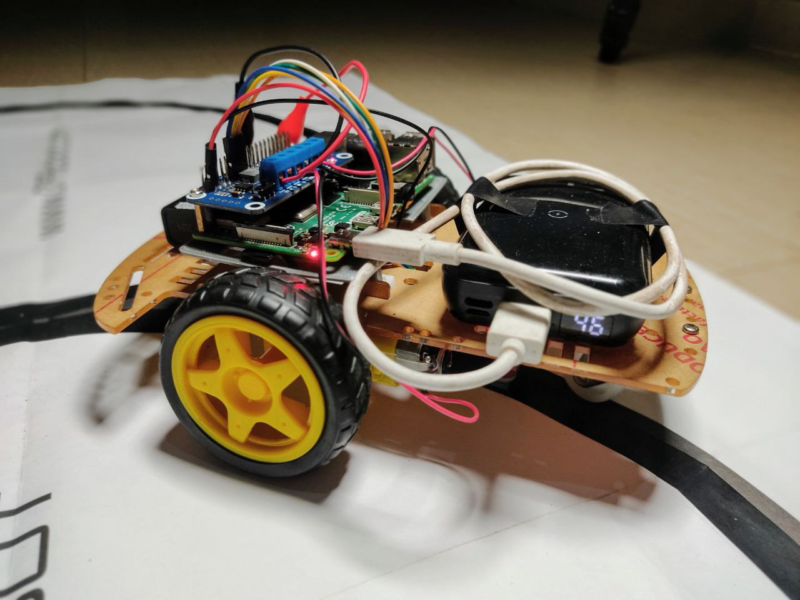

# 2 Wheeled Drive Raspberry Pi Line Follower running ROS1 Noetic
A 2-wheel drive car, controlled by a Raspberry Pi 4 running Robot Operating System (ROS) 1 Noetic, is used as a line following robot; it follows a black line against a white background, with the aid of a 5 channel infrared sensor.

## Hardware

### Components
The components used in this project are as follows:

- 2 wheeled drive robot chassis
- Raspberry Pi 4
- Monitor, keyboard and mouse for initial setup
- Motor driver HAT (Waveshare)
- 2 x standoff spacers
- 5-channel infrared sensor (Waveshare)
- 9V battery
- 2 x alligator clip cables 
- Powerbank rated at least 5V and 3A with USB type-A to USB-type C cable to power RPi
- Wires - to connect motors to motor driver HAT
- Track(s) for robot to follow
- Screwdriver set
- Double-sided tape
- Duck tape

The 5-channel infrared sensor from Waveshare are shown in the figures below:
<p float="center">
  
  
</p>

The front, back and side views of the Motor driver HAT are as shown:
<p float="center">
  
  
  
</p>

### Assembly

The 2 wheeled robot chassis is assembled using the guide shown [here](https://www.ardu.dk/wp-content/uploads/2019/11/ARDU-2WD-robot-car-instructions.pdf). The motor driver HAT is firmly attached to the GPIO pins on the Raspberry Pi with standoff spacers for added stability. The 5 channel infrared sensor is mounted underneath the robot chassis and connected to the RPi GPIO pins via the motor driver HAT in this order:

| Infrared sensor | Cable color | GPIO.BOARD | GPIO.BCM |
| ------ | ------ | ------ | ------ |
| IR1 | Blue | 19 | GPIO16 |
| IR2 | Yellow | 21 | GPIO17 |
| IR3 | Orange | 23 | GPIO18 |
| IR4 | Green | 22 | GPIO13 |
| IR5 | White | 24 | GPIO19 |

The red and black cables are connected to a 5V and ground (GND) GPIO pins respectively.

The RPi was placed on a 3D printed platform using double-sided tape, which was mounted to the chassis also with double-sided tape. 

One end of the cables from the motors were soldered with the other end connected to the motor driver HAT. The motor driver HAT is powered using the 9V battery via the alligator cables. 

Finally, the raspberry pi is powered by the power bank, via a USB type-A to USB type-C cable, which is mounted on the chassis with double-sided tape.

The fully assembled robot is shown in the following images:

<p float="center">
  
  
  
</p>

## Software

### Software architecture
**Raspberry Pi OS** is the operating system used on the Raspberry Pi 4. The download and installation procedure can be found [here](https://www.raspberrypi.org/software/). ROS 1 Noetic is the version of ROS used in this project and can be installed following this [guide](https://www.hackster.io/shahizat005/lidar-integration-with-ros-noetic-on-raspberry-pi-os-8ea140).

For ease of access, debugging and mobility, the Raspberry Pi (and further robot operations) is setup in a headless or remote mode using the [VNC Viewer](https://www.raspberrypi.org/documentation/computers/remote-access.html#vnc) or [ssh](https://www.raspberrypi.org/documentation/computers/remote-access.html#ssh) for more advanced users.

### Package install and setup

Once Raspberry Pi OS and ROS Noetic have been successfully setup, the next step is to download and setup the ROS package in this repository. 

Open up a terminal window and navigate to the source folder in your ROS workspace (```ros_catkin_ws/src``` in my case) and clone this repository by executing the following command in the terminal:
```
git clone https://github.com/TheNoobInventor/2wd-rpi-ros-line-follower.git
```
The motor driver HAT uses Inter-Integrated Circuit (I2C) serial interface to communicate with the Raspberry Pi. This interface needs to be enabled in Raspberry Pi OS, which is disabled by default. To do this, click on the ***RPi Home*** button, navigate to ***Preferences***, then ***Raspberry Pi Configuration*** to ***I2C*** and finally click on the ***Enable*** radio button. Then reboot the RPi for this change to be effected.

#### Build package
---
To build the package, move up one level to the main ROS workspace (```ros_catkin_ws```) and run the following command in the terminal:

```
catkin_make
```
#### Custom message
---
A custom message - ```IrSensor.msg``` in the ```msg``` folder -  of type int32, was created to store data outputted from the different channels of the infrared sensor.

#### Run package nodes
---
There are two ROS nodes -- written in **Python3** -- in this package in the ```src``` directory:

```ir_sensor_node.py``` - this publishes data about the values 
returned by the 5 channel infrared sensor, through the topic 'infra_readings' 

```rpi_car_main_node.py``` - this node subscribes to the infrared sensor data in the 'infra_readings' topic and uses this data to control the robot to move around the track(s).

Before running these nodes, the following python packages will need to be installed - if they are not already installed:

```rospkg``` - this provides basic utilities for querying information about ROS packages and stacks.

```smbus``` - this package is required by the PCA9685 PWM controller in order to use the i2c serial interface.

Open up a new terminal window and run the following command:
```
pip3 install rospkg && pip3 install smbus
```
In addition to the node files previously introduced, these two files are needed in this package:

```PCA9685.py``` - this is a low-level driver script to use the PCA9865 PWM controller employed by the motor driver HAT to control the motors.

```motor.py```- this is a motor class which uses the PCA9685 PWM controller to control the speeds of the motors connected to the motor driver HAT.

In order to run the nodes, the files first need to be made executable. This can be achieved by running this command in a terminal window:
```
chmod +x ir_sensor_node.py rpi_car_main_node.py
```

Both nodes can be started up at once by using the launch file ```rpi_car.launch``` in the ```src/launch``` directory. Execute the following commad:
```
roslaunch rpi_car_line_follower rpi_car.launch
```
For debugging purposes, the infrared sensor data can be viewed by echoing the data from the 'infra_readings' topic in a separate terminal window:
```
rostopic echo /infra_readings
```

## Race tracks

The following race tracks are used to test out the ROS package:

<p float="left">
  
</p>
<p float="right">
  
</p>

With the robot placed on the black line of the track, the launch file is executed. The main node, ```rpi_car_main_node.py```, attempts to keep the robot on the black line whilst moving around the track. It uses data from the infrared sensors - which return 0 if they are over a black line or 1 if they are over the white part of the track. These numbers are used in varying the speeds of the motor to get the robot to follow the line. This process is shown in the following code block from the main node:

```
if (ir_1 == 1 and ir_2 == 1 and ir_3 == 0 and ir_4 == 1 and ir_5 == 1):
    # Move robot forward
    Motor.MotorRun(0, 'forward', 70)
    Motor.MotorRun(1, 'forward', 70)
elif (ir_1 == 1 and ir_2 == 0 and ir_3 == 0 and ir_4 == 1 and ir_5 == 1):
    # Move robot slightly left
    Motor.MotorRun(0, 'forward', 65)
    Motor.MotorRun(1, 'forward', 70)
  ...
```

The motor speeds were obtained iteratively through trial and error.

It was observed that the initial black lines of the race tracks were too thin and caused issues with the infrared sensors accurately returning values. Duck tape was used to widen the track to enable each infrared sensor to read the black line correctly.ll.

## Rqt graph

The nodes and topics relations can be viewed by making use of the ROS tool: ***rqt***. Run rqt by executing this command in the terminal:
```
rqt
```
In the Graphical User Interface (GUI) that opens up, click on check-button on the 'infra_readings' topic. Afterward, navigate to ***Plugins*** in the menu then to ***Introspection*** and click on ***Node graph***. This will output a window with the following image showing the relationship between the nodes and the 'infra_readings' topic:

<p align="center"> </p>

## Video demonstration

The following video (clicking the image below) walks through the setup procedure for this project and shows the robot moving around both tracks whilst following the black line.

[](https://youtu.be/u9ZQiseMk1M)

## Future work

Some suggestions for upgrades include:

- Moving project over to ROS2.

- Employing a better power solution using a set of 18650 batteries instead of the 9V battery.

- Adding more sensors to increase the complexity.

## References

- [Motor Driver HAT](https://www.waveshare.com/wiki/Motor_Driver_HAT)

- [Infrared Sensor](https://www.waveshare.com/wiki/Tracker_Sensor)

- [Rospkg](https://rospkg.readthedocs.io/en/latest/)

- [smbus package](https://pypi.org/project/smbus2/)
